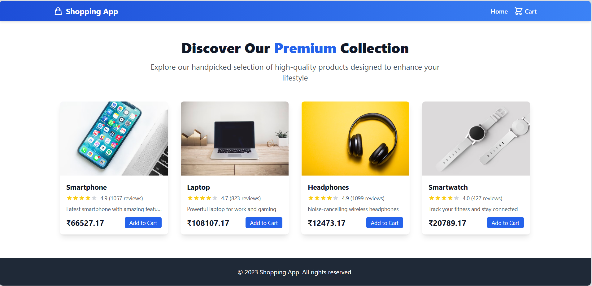
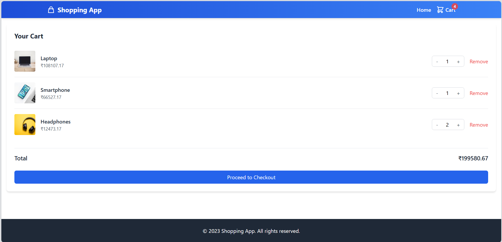
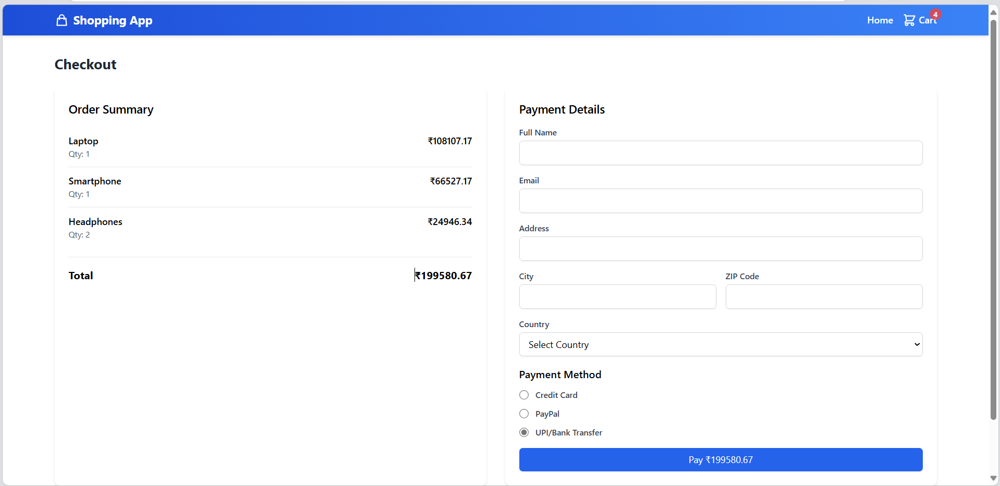

# E-Commerce Product Gallery

A responsive e-commerce product gallery built with React and styled using Tailwind CSS.

## Features

- Responsive grid layout adapting to different screen sizes
- Interactive product cards with hover effects
- Product detail modal on click
- Add to cart functionality
- Clean and modern UI design

## Screenshots





## Installation

1. Clone the repository:
```bash
git clone https://github.com/shrushtijadhavv/react-ecommerce-gallery.git
cd react-ecommerce-gallery
```

2. Install dependencies:
```bash
npm install
```

3. Start the development server:
```bash
npm start
```

4. Open your browser and navigate to `http://localhost:3000`

## Technologies Used

- React
- TypeScript
- Tailwind CSS
- Context API for state management

## Project Structure

- `src/components/` - React components including ProductList and ProductModal
- `src/context/` - Context providers for cart functionality
- `src/data/` - Product data and interfaces
